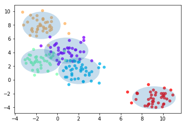
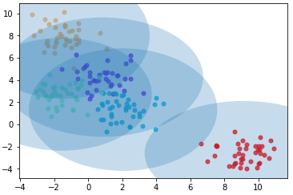
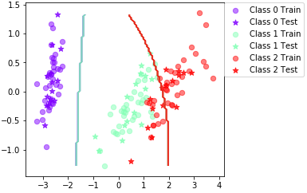

# LAB 3


## Assignment 1

Firstly, we use the provided function genBlobs(), to plot the the Gaussian distributed datapoints, together with their class labels, providing a number of centers as parameters. Then we add the ML estimates, and plot it all together with the function plotGaussian().



*Figure 1.1 - centers = 5*


## Assignment 2

The following functions were completed:

- computePrior(labels)
- classifyBayes(X,prior,mu,sigma)


## Assignment 3

### Iris dataset

The following is the datapoints including blobs:



The following is the plot boundary:



Trial | Accuracy
--- | ---
0 | 84.4
10 | 86.7
20 | 88.9
30 | 86.7
40 | 86.7
50 | 91.1
60 | 88.9
70 | 93.3
80 | 86.7
90 | 88.9

*Final mean classification accuracy: 88.1*  
*Standard deviation: 4.14*

### Vowel dataset
Trial | Accuracy
--- | ---
0 | 58.4
10 | 66.9
20 | 67.5
30 | 57.8
40 | 63.6
50 | 63
60 | 64.9
70 | 62.3
80 | 59.1
90 | 70.1

*Final mean classification accuracy: 62.6*  
*Standard deviation: 3.54*

1) **When can a feature independence assumption be reasonable and when not?**
In general, it is often not realistic to think features are independent, but it may be a useful assumption in order to reduce complexity. For example, if we want to classify  book genres, we can use the words as features. The words will often indicate the genre of book, but occurence of words may also correlate to occurence of other words. However, this factor is very hard to actually mathematically implement, and the model may still be very powerful regardsless of feature dependence, so the assumption can be reasonable to make. However, it is not reasonable to made such an assumption when its probable that there is a very high dependence of features or when there is a high risk involved in a bad model.

2) **How does the decision boundary look for the Iris dataset? How could one improve the classication results for this scenario by changing classifier or, alternatively, manipulating the data?**
There are two boundaries which divide the three classes. The classes 0 and 1 are divided successfully, but the classes 1 and 2 are divided using a quite unintuitive curve. By looking at the datapoints, it should rather be divided with a straight line leaning up-right.A low-complexity SVM with some slack would probably be a good alternative of a classifier.


## Assignment 4

```python
[1] Nk = len(idx)
[2] xlc = X[idx,:]*W[idx,:] #get row vectors
[3] mu[jdx] += np.sum(xlc, axis=0) / weightsum
```

[2]

